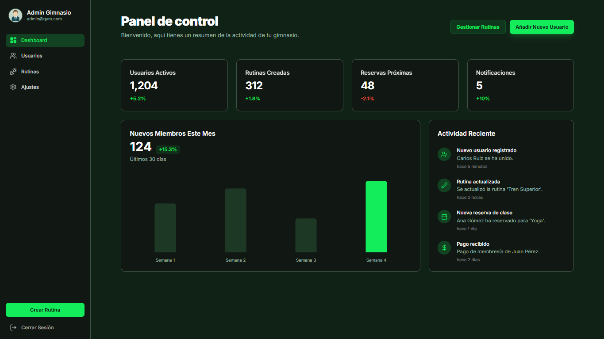
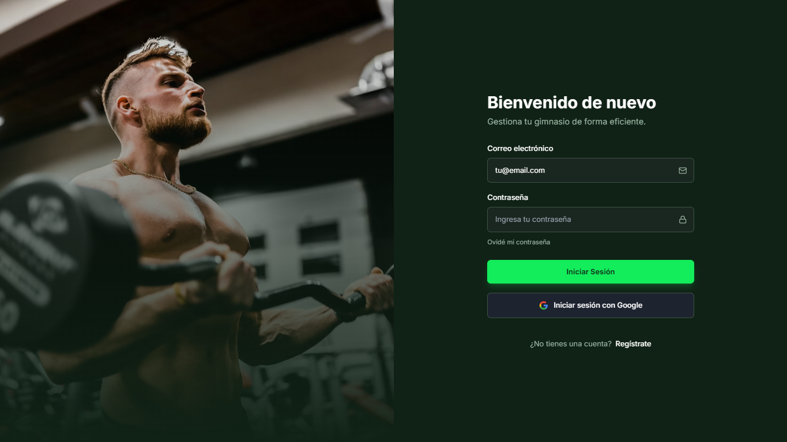
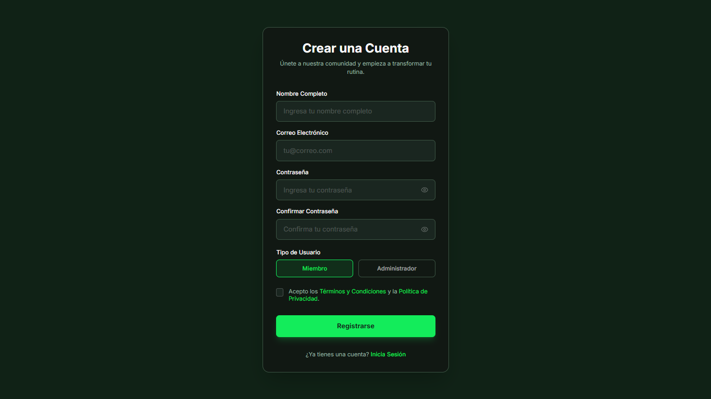
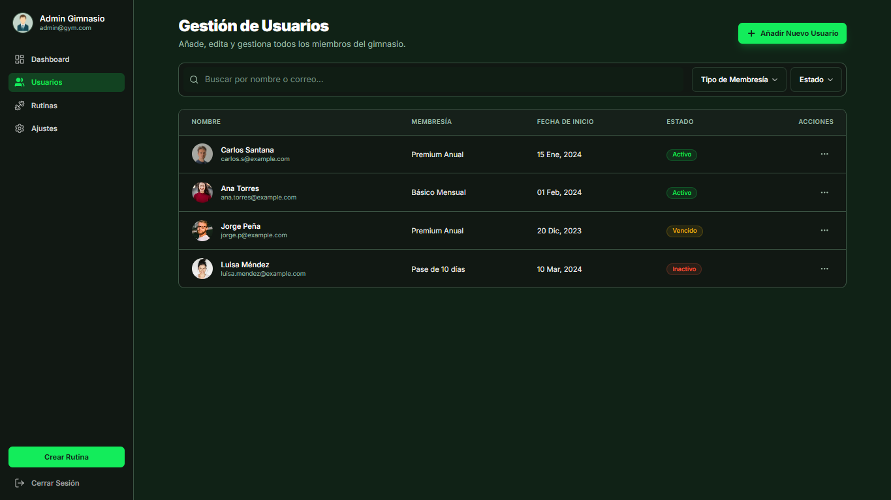
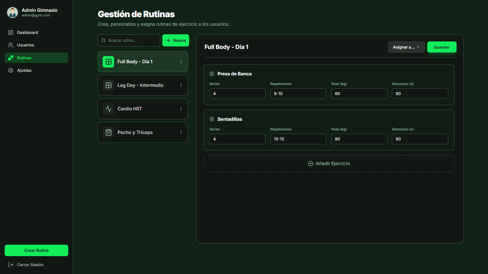
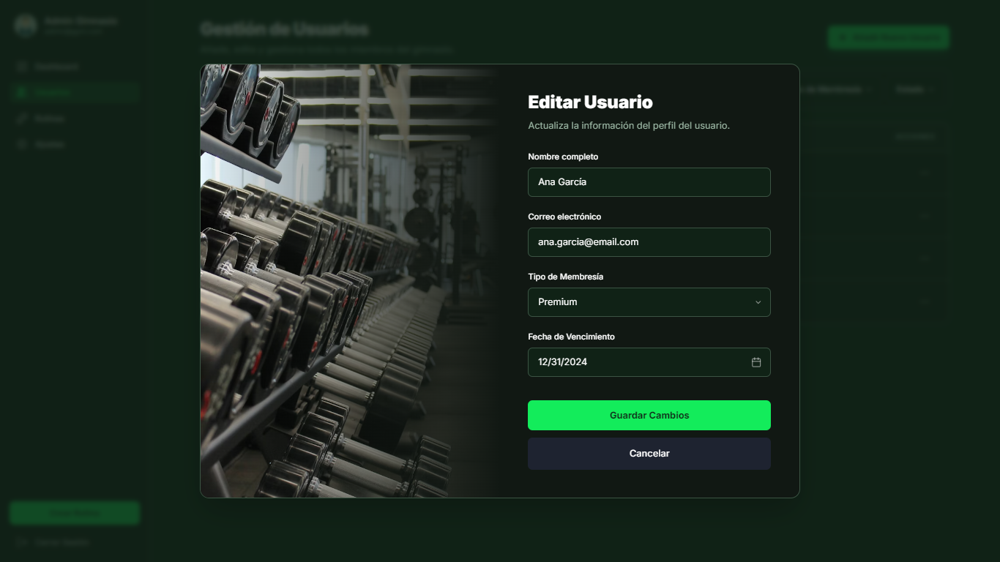
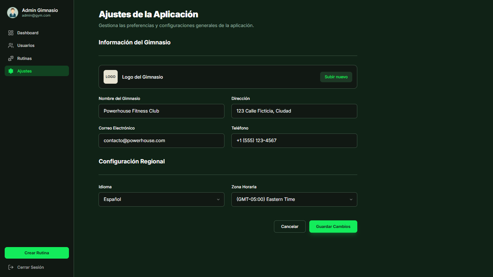
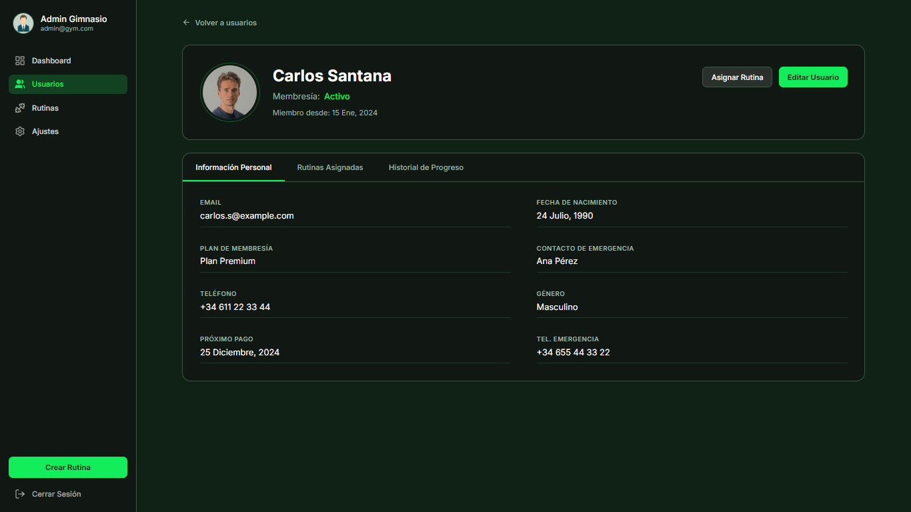

# GYM ADMIN DASHBOARD

**Contenido**

- [Prerequisitos](#prerequisitos)
- [Instalación](#instalacion)
- [Scripts útiles](#scripts-útiles)
- [Variables de entorno](#variables-de-entorno)
- [Estructura del proyecto (resumen)](#estructura-del-proyecto-resumen)
- [Notas finales](#notas-finales)
- [Capturas de pantalla](#capturas-de-pantalla)

Breve panel de administración para gestionar miembros, rutinas y estadísticas de un gimnasio.

<a name="prerequisitos"></a>
**Prerequisitos**

- **Node.js**: versión 18 LTS o superior. Instala desde `https://nodejs.org/`.
- **npm** (incluido con Node.js) o **pnpm/yarn** como alternativa para gestionar dependencias.
- **Git**: para clonar el repositorio.
- **Navegador moderno**: Chrome, Edge, Firefox o Safari.

<a name="instalacion"></a>
**Instalación**

1. Clona el repositorio (reemplaza `<repo-url>` por la URL real):

```bash
git clone https://github.com/PacchaDavid/GymAdmin
cd gym-admin-dashboard
```

2. Instala dependencias:

Linux / macOS (bash/zsh):

```bash
npm install
# o con pnpm
# pnpm install
```

Windows (PowerShell / `pwsh`):

```powershell
git clone https://github.com/PacchaDavid/GymAdmin
Set-Location -Path .\gym-admin-dashboard
npm install
# o con pnpm
# pnpm install
```

<a name="scripts-útiles"></a>
**Scripts útiles**

Los scripts definidos en `package.json` son:

- `npm run dev`: Inicia el servidor de desarrollo (Vite) en modo HMR.
- `npm run build`: Genera los archivos de producción optimizados.
- `npm run preview`: Previsualiza la build de producción localmente.

Ejecutar el servidor de desarrollo:

```bash
npm run dev
```

Construir para producción:

```bash
npm run build
```

Previsualizar la build:

```bash
npm run preview
```

<a name="variables-de-entorno"></a>
**Variables de entorno**

Este proyecto no requiere variables de entorno especiales por defecto. Si añades una API externa o configuración, crea un archivo `.env` y pásalo según tu configuración de Vite.

<a name="estructura-del-proyecto-resumen"></a>
**Estructura del proyecto (resumen)**

- `index.tsx`, `App.tsx` - punto de entrada y componente raíz.
- `vite.config.ts` - configuración de Vite.
- `components/` - componentes React usados por la app, por ejemplo:
	- `UsersScreen.tsx`, `UserDetailScreen.tsx`, `Sidebar.tsx`, `Header.tsx`, etc.
- `types.ts` - tipos TypeScript compartidos.

Adapta la estructura según tus necesidades de expansión.

<a name="notas-finales"></a>
**Notas finales**

- Si usas Windows y encuentras problemas con permisos o rutas, ejecuta PowerShell como administrador o usa WSL2.

<a name="capturas-de-pantalla"></a>
**Capturas de pantalla**

- `01-dashboard.png` — Dashboard
   

- `02-login.png` — Login
   

- `03-register.png` — Registro
	

- `04-users.png` — Gestión de usuarios
	

- `05-routines.png` — Gestión de rutinas
	

- `06-edit-user.png` — Edición de usuarios
	

- `07-settings.png` — Ajustes
	

- `08-user-detail.png` — Detalles de usuario
	
